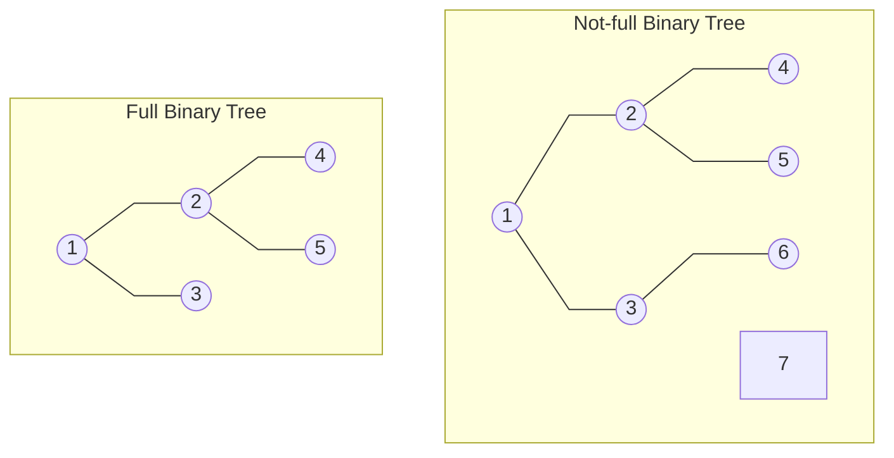
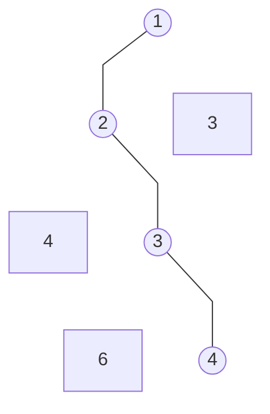
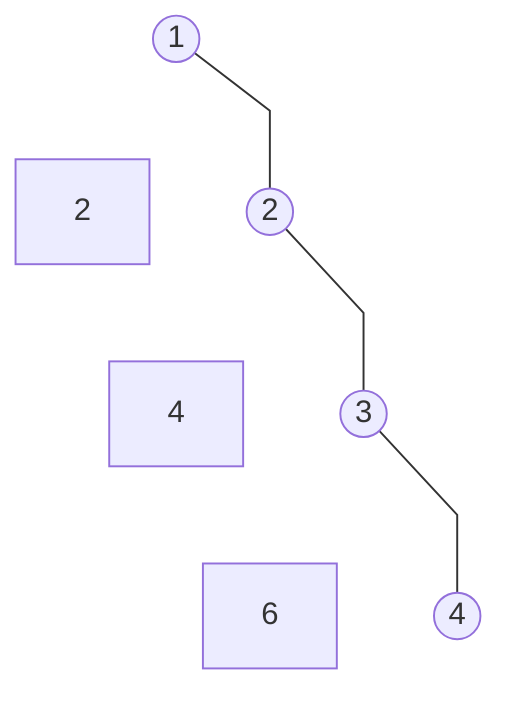
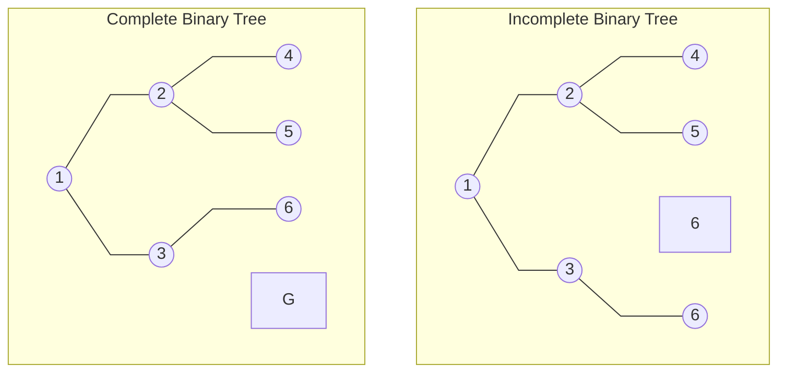
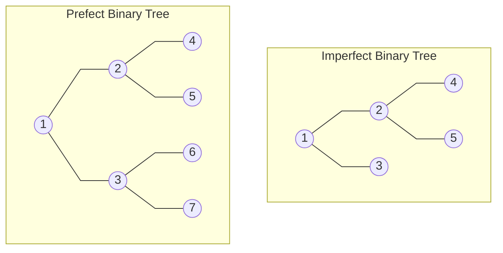
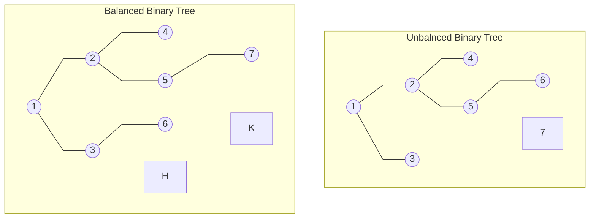

# Binary Tree란 무엇인가

트리의 정의부터 다시 짚고 넘어가자면, 트리는 equivantly conntected undirected acyclic graph 이다. 즉 모든 노드가 연결되어있는 방향성이 없고 사이클이 없는 그래프 인것이다. Binary Tree는 트리 중에서도 모든 노드가 2이하의 degree (혹은 2개이하의 자식노드)를 가지고 있는 트리를 말한다. 이 binary tree도 여러개의 종류가 있는데 지금 부터 살펴보자

# Full Binary Tree (정 이진트리)

Binary tree의 모든 노드가 0 혹은 2개의 자식 노드를 가지고 있을때 full binary tree 라고 부른다. 또는 leaf 노드를 제외한 모든 노드가 2개의 자식 노드를 가지고 있는것을 말한다.

# Degenerate (or pathological) Binary Tree (사향 이진트리)

모든 Internal 노드 (leaf 노드가 아닌 모든 노드)가 하나의 자식만을 가지고 있을때 degenerate binary tree라고 한다. Binary search tree가 아래와 같은 모양을 하게 된다면 O(logn)의 시간 복잡도를 가지고 있는 검색 연산이 O(n)으로 느려지게 된다.

# Skewed Binary Tree (편향 이진트리)

Skewed Binary Tree란 왼쪽이나 오른쪽 한쪽으로만 기울어져 있는 degenerate tree 이다. 치우쳐진 방향에 따라서 left-skewed binary tree와 right-skewed binary tree로 나눌수 있다. 아래는 right-skewed binary tree 를 나타낸것이다.

# Complete Binary Tree (완전 이진트리)

마지막 레벨을 제외하고 모든 레벨이 완전히 채워져 있는 트리이다. 마지막 레벨은 꽉 차 있지 않아도 되지만 (정 이진 트리일 필요가 없다) 노드가 왼쪽에서 오른쪽으로 채워져야 한다. 우선순위 큐를 구현하기 위해 사용되는 자료구조인 Heap은 complete binary tree이다.

# Perfect Binary Tree (포화 이진 트리)

Perfect binary tree는 모든 internal nodes가 두 개의 자식 노드를 가지며 모든 leaf nodes가 동일한 깊이 또는 레벨을 갖는다.

# Balanced Binary Tree (균형 이진트리)

Balanced Binary Tree는 왼쪽 subtree와 오른쪽 subtree의 높이 차이가 모두 1만큼 나는 트리이다. AVL트리와 Red-black tree는 balanced binary tree 이다.

