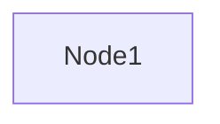
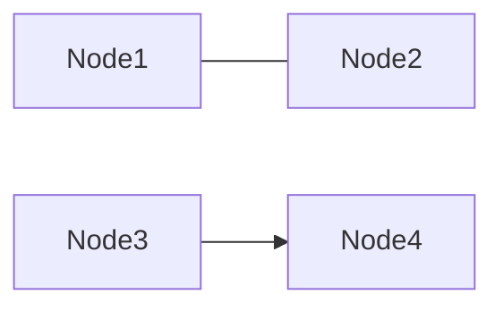
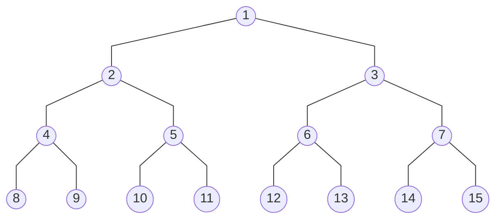
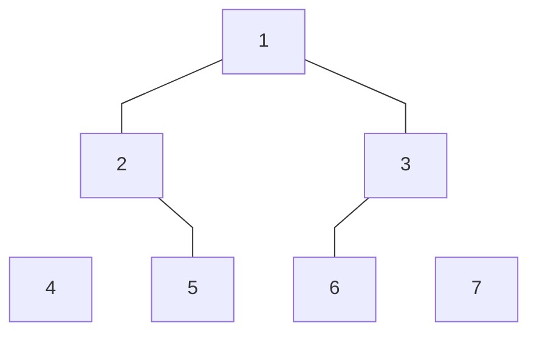
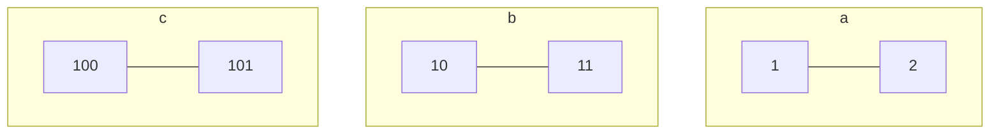

# 서론

요즘 TIL을 작성하면서 다이어그램을 그려서 올리고 싶을때가 많아졌다. 예를들면 binary search tree 에 관한 글을 쓸때 삽입과 삭제 연산을 글과 코드로만 적는것보다 트리를 그려서 같이 첨부하면 이해하기가 훨씬 더 수월할 것이다. 

[draw.io](http://draw.io/) 같은 서비스를 이용하자니, 아이패드로 그리기에는 좀 불편함이 많았고 내가 필요없는 기능이 많았다. 그러던 도중 지인의 추천으로 [Mermaid](https://mermaid.js.org/) 라는 프로젝트를 접하게 되었다. 다이어그램을 마크다운 같은 코드로 작성해서 그리는 방식인데 아이패드로 간단히 그리기 편리할 것 같았다. 무엇보다도 Notion에서 지원한다고 하니 너무 매력적 이였다.

# Mermaid

JavaScript 기반의 다이어그램 및 차트 그리는 툴이다. 오픈소스(MIT)로 무료로 이용할 수 있다. Mermaid는 마크다운 같은 형식의 mermaid syntax로 작성한 텍스트를 다이어그램으로 변환해준다. 홈페이지에 Live Editor도 있으니까 쉽게 테스트 해볼 수 있다.

Notion에 코드블럭을 사용할때 언어를 Mermaid 로 바꿔주면 다이어그램이 렌더링된다. Visual Studio Code에도 Extension이 있어서 사용가능하다. 이제 몇가지 사용 예시를 적어보겠다.

## Flowchart

Nodes와 edges로 구성된 차트를 Flowchart라고 하고 자료구조로 표현하면 그래프와 트리이다.

예시1) 노드 하나

예시2) 노드 두개 연결

예시3) Perfect binary tree

예시4) Invisible node and link

예시5) Subgraph

